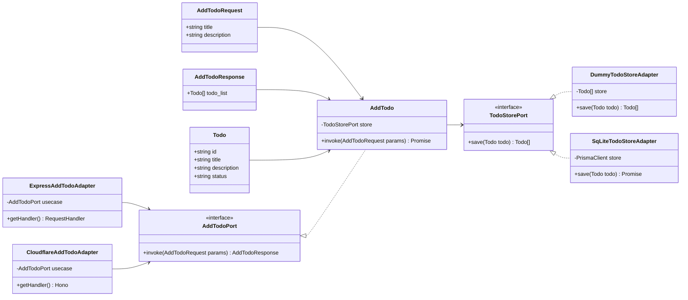

# hexagonal-todo-express

This is a project created for learning hexagonal architecture.

## Usage

### Node - Express

#### With Dummy Store

1. Install dependencies

```sh
npm install
```

2. Uncomment lines 14-16 in ./src/main/express/apiRoutes.ts.

```typescript
// dammy Todo store
const DummyTodoStore: Todo[] = [];
const dummyTodoStoreAdapter = new DummyTodoStoreAdapter(DummyTodoStore);
const addTodoUseCase = new AddTodo(dummyTodoStoreAdapter);
```

3. Comment out lines 19-21 in ./src/main/express/apiRoutes.ts.

```typescript
// sqlite Todo store
// const prisma = new PrismaClient();
// const sqliteTodoStoreAdapter = new SqLiteTodoStoreAdapter(prisma);
// const addTodoUseCase = new AddTodo(sqliteTodoStoreAdapter);
```

4. Start Dev Server

```sh
npm run express:dev
```

#### With Sqlite

1. Install dependencies

```sh
npm install
```

2. Comment out lines 14-16 in ./src/main/express/apiRoutes.ts.

```typescript
// dammy Todo store
// const DummyTodoStore: Todo[] = [];
// const dummyTodoStoreAdapter = new DummyTodoStoreAdapter(DummyTodoStore);
// const addTodoUseCase = new AddTodo(dummyTodoStoreAdapter);
```

3. Uncomment lines 19-21 in ./src/main/express/apiRoutes.ts.

```typescript
// sqlite Todo store
const prisma = new PrismaClient();
const sqliteTodoStoreAdapter = new SqLiteTodoStoreAdapter(prisma);
const addTodoUseCase = new AddTodo(sqliteTodoStoreAdapter);
```

4. Run Prisma Migrate.

```sh
npm run migrate
```

5. Start Dev Server

```sh
npm run express:dev
```

### Hono - Cloudflare Workers

1. Install dependencies

```sh
npm install
```

2. Start Dev Server

```sh
npm run hono:dev
```

## Entity Relationships and Dependencies

